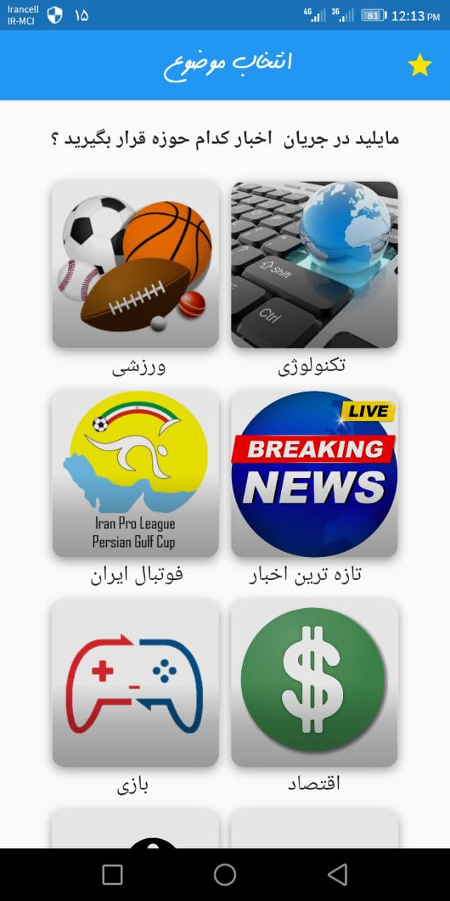
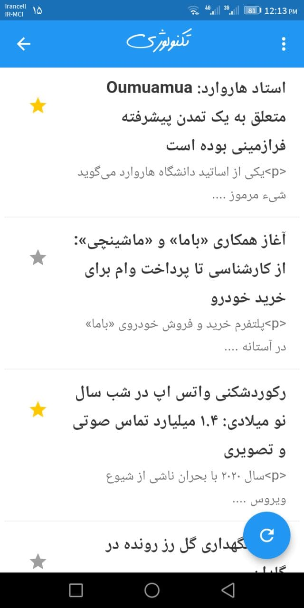

# kelid khabar

An application you can use to get some news in different categories 
set some of them as favorites
see the the full text of special news 

## Screenshots

    

## Building

To build and run the app on your device, do the following:

-   [Install Flutter](https://flutter.dev/docs/get-started/install/) by following the instructions on their website.
-   Fork/clone this repo to your local machine using `git clone https://github.com/b3hzadsh/feeds.git`.
-   Connect your devices/emulators and run the app using `flutter run --release` in the root of the project directory.

Note: you can also run it faster in debug mode using `flutter run`, but the animations will be choppy and performance won't be as expected.

## Contributing

Found any bugs? Have any suggestions or code improvements? [Submit an issue](https://github.com/b3hzadsh/feeds/issues) or fork and send a [pull request](https://github.com/b3hzadsh/feeds/pulls) with your changes. All contributions are more than welcome, and will be merged into `flutter` (the default branch) if satisfactory.

## License

This project is licensed under the GPL License .
